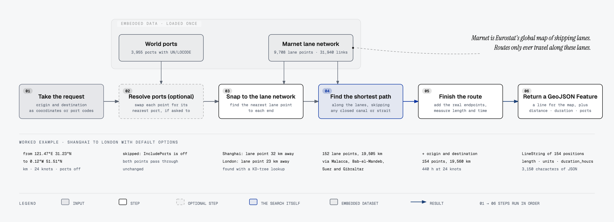
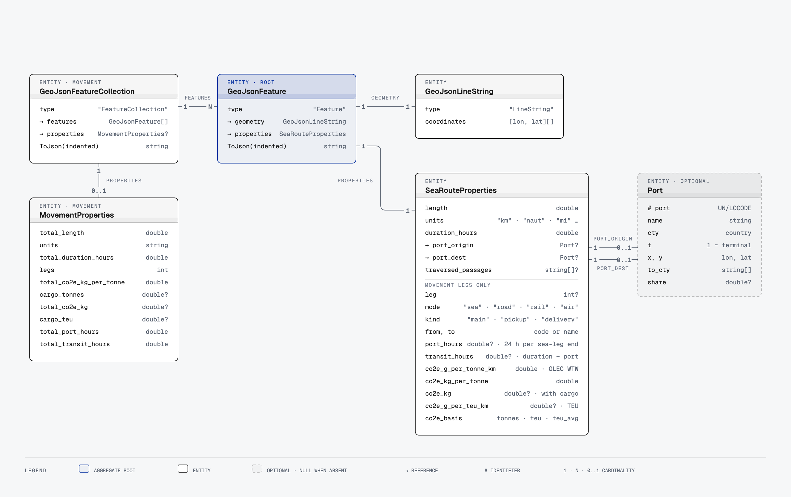
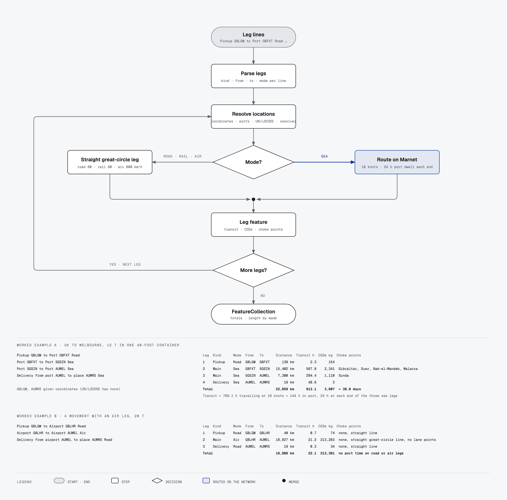

# SeaRoute.Net

[](https://dotnet.microsoft.com)
[](LICENSE)
[](src/SeaRoute/SeaRoute.csproj)

Shortest sea route between any two points on Earth, as a single self-contained .NET library.

Give it two coordinates or two UN/LOCODE port codes and it returns an RFC 7946 GeoJSON `LineString` with the distance, the voyage duration, the ports used and the canals and straits passed through. The Eurostat Marnet shipping network and a world ports database are compressed and embedded in the assembly, so there is nothing to download, configure or host.

```csharp
using SeaRoute;
using SeaRoute.Common;

var engine = SeaRouteEngine.Default;

var route = engine.CalculateRoute(
    new Coordinate(5.333333, 43.333333),    // Marseille  (lon, lat)
    new Coordinate(18.366667, -33.916667),  // Cape Town
    new SeaRouteOptions { AppendOriginDestination = true });

Console.WriteLine($"{route.Properties.Length:N0} {route.Properties.Units}, {route.Properties.DurationHours:N0} h");
// 10,997 km, 247 h
```

---

## Contents

- [How it works](#how-it-works)
- [What you get back](#what-you-get-back)
- [Installation](#installation)
- [Usage](#usage)
- [Options reference](#options-reference)
- [Performance](#performance)
- [Repository layout](#repository-layout)
- [Building, testing and trying it out](#building-testing-and-trying-it-out)
- [Data](#data)
- [Licence](#licence)

---

## How it works

Every request goes through the same six steps, in order. The datasets are decompressed and indexed once on first use, then shared read-only by every thread.

<p align="center">
  
</p>

1. **Take the request.** An origin and a destination, as coordinates or UN/LOCODE port codes, plus options such as units, vessel speed and closed passages.
2. **Resolve ports** only if `IncludePorts` is set. Each end is swapped for its nearest port from the embedded list of 3,955, optionally limited to container terminals or a country.
3. **Snap to the lane network.** Each end is matched to the nearest point on Marnet, Eurostat's map of shipping lanes, using a KD-tree. Shanghai's request point is 32 km from its lane point, London's 23 km.
4. **Find the shortest path** along the lanes with bidirectional Dijkstra, or A* on request. Lane links through a closed canal or strait are skipped; the Northwest Passage is closed by default. Shanghai to London gives 152 lane points over 19,505 km, through Malacca, Bab-el-Mandeb, Suez and Gibraltar.
5. **Finish the route.** With `AppendOriginDestination` the real endpoints are added, longitudes are unwrapped across the antimeridian, and length and duration are measured: 154 points, 19,560 km, 440 hours at 24 knots.
6. **Return a GeoJSON Feature**: a LineString for the map plus distance, units, duration, the ports used and the passages traversed.

Source: [docs/diagrams/routing-pipeline.svg](docs/diagrams/routing-pipeline.svg) (vector) and [routing-pipeline.html](docs/diagrams/routing-pipeline.html).

Key design points:

- **Graph.** 9,708 nodes and 31,940 directed edges stored in a compressed sparse row layout. Edge weights are great-circle kilometres. Edges through canals and straits carry a passage tag.
- **Search.** Bidirectional Dijkstra by default, A* on request. Both use per-thread, node-indexed scratch arrays with generation stamps, so a query allocates only its result.
- **Restrictions.** A restricted passage removes its tagged edges from the search. The Northwest Passage is restricted by default. If no path survives, the result has empty geometry and zero length rather than an exception.
- **Antimeridian.** Trans-Pacific routes are emitted with continuous longitudes, so a map library draws one line instead of a wrap-around artefact.
- **Ports.** With `IncludePorts`, each endpoint is replaced by its nearest port, optionally filtered to container terminals or a country. Area polygons can name several preferred ports with share weights, in which case one route per port is returned.

## What you get back

`CalculateRoute` returns a `GeoJsonFeature`. `ToJson()` serialises it to standard GeoJSON that Leaflet, Mapbox GL, OpenLayers, deck.gl, QGIS and PostGIS all consume directly.

<p align="center">
  
</p>

Source: [docs/diagrams/output-model.svg](docs/diagrams/output-model.svg) (vector) and [output-model.html](docs/diagrams/output-model.html).

Example output for the Persian Gulf to the Caribbean with Suez closed, trimmed for length:

```json
{
  "type": "Feature",
  "geometry": {
    "type": "LineString",
    "coordinates": [[52.99, 25.01], [56.4, 26.6], [57.2, 24.4], "...", [-61.87, 17.15]]
  },
  "properties": {
    "length": 19463.2,
    "units": "km",
    "duration_hours": 437.9,
    "traversed_passages": ["ormuz", "south_africa"]
  }
}
```

| Property | Meaning |
|---|---|
| `length` | Total route length in the requested unit. |
| `units` | Unit identifier, for example `km`, `naut`, `mi`. |
| `duration_hours` | Length divided by vessel speed, default 24 knots. |
| `port_origin`, `port_dest` | Present when routing by port code or with `IncludePorts`. |
| `traversed_passages` | Present when `ReturnPassages` is set. Lower-case identifiers listed below. |

## Installation

```bash
dotnet add package SeaRoute.Net
```

Targets `net8.0` and `net10.0`. The package has no dependencies beyond the base class library and `System.Text.Json`.

## Usage

### Engine or static facade

`SeaRouteEngine.Default` is a lazily initialised singleton that owns the graph and port index. Register it for dependency injection, or use it directly:

```csharp
builder.Services.AddSingleton<ISeaRouteEngine>(SeaRouteEngine.Default);
```

```csharp
public sealed class ShippingController(ISeaRouteEngine seaRoute) : ControllerBase
{
    [HttpGet("route")]
    public IActionResult GetRoute(double fromLon, double fromLat, double toLon, double toLat)
    {
        var feature = seaRoute.CalculateRoute(fromLon, fromLat, toLon, toLat);
        return Content(feature.ToJson(), "application/geo+json");
    }
}
```

The static `SeaRouter` class wraps the same engine with named parameters, one per option:

```csharp
var route = SeaRouter.Calculate(origin, destination, appendOrigDest: true);
```

### Avoiding canals and straits

```csharp
using SeaRoute.Passages;

var route = SeaRouter.Calculate(
    new Coordinate(52.99, 25.01),     // Persian Gulf
    new Coordinate(-61.87, 17.15),    // Caribbean
    restrictions: [Passage.Suez],
    returnPassages: true);

// route.Properties.TraversedPassages == ["ormuz", "south_africa"]
```

Recognised passages: `Babalmandab`, `Bering`, `Bosporus`, `Chili` (Magellan Strait), `Dardanelles`, `Gibraltar`, `Malacca`, `Northwest` (restricted by default), `Ormuz`, `Panama`, `SouthAfrica` (Cape of Good Hope), `Suez`, `Sunda`. Each one, and every kind of waypoint a route can contain, is described with measured detour distances in [docs/waypoints-and-choke-points.md](docs/waypoints-and-choke-points.md).

### Routing between ports

```csharp
var route = SeaRouter.Calculate("FRLEH", "CNTSN");   // Le Havre to Tianjin, UN/LOCODE
Console.WriteLine($"{route.Properties.PortOrigin!.Name} to {route.Properties.PortDest!.Name}");
```

### Inland points resolved to the nearest terminal

```csharp
using SeaRoute.Ports;

var route = SeaRouter.Calculate(
    new Coordinate(2.333333, 48.866667),      // Paris
    new Coordinate(139.679174, 35.778467),    // Tokyo
    includePorts: true,
    appendOrigDest: true,
    portParams: new PortParameters { OnlyTerminals = true });

// route.Properties.PortOrigin.PortCode == "FRURO" (Rouen), PortDest == "JPTYO"
```

### Weighted preferred ports per area

```csharp
var belgium = new AreaFeature(
    coordinates: belgiumBoundary,
    name: "BE",
    preferredPorts: [new PortProps("BEANR", share: 250), new PortProps("FRLEH", share: 200)]);

var routes = SeaRouteEngine.Default.CalculateRoutes(brussels, tokyo, new SeaRouteOptions
{
    IncludePorts = true,
    PortParameters = new PortParameters { PortsInAreasFrom = [belgium] }
});

// Two features: one via Antwerp (share 0.56), one via Le Havre (share 0.44)
```

### Multi-leg movements

A movement is a list of legs, one per line, in the form `[Pickup|Delivery] [port|place] CODE to [port|place] CODE MODE`. Sea legs are routed on the network. Road, rail and air legs are straight great-circle lines with a configurable speed per mode.

<p align="center">
  
</p>

Source: [docs/diagrams/movement-flow.svg](docs/diagrams/movement-flow.svg) (vector) and [movement-flow.html](docs/diagrams/movement-flow.html).

```csharp
using SeaRoute.Movements;

const string legs = """
    Pickup GBLGW to Port GBFXT Road
    Port GBFXT to Port SGSIN Sea
    Port SGSIN to Port AUMEL Sea
    Delivery from port AUMEL to place AUMRS Sea
    """;

// Codes that are not in the embedded port list need a coordinate, or an ILocationResolver.
var places = new Dictionary<string, Coordinate>
{
    ["GBLGW"] = new(-0.190278, 51.148056),
    ["AUMRS"] = new(145.13, -37.92)
};

var movement = SeaRouter.CalculateMovement(legs, places);

foreach (var leg in movement.Legs)
    Console.WriteLine($"{leg.Sequence} {leg.Leg.Mode} {leg.From.Label} to {leg.To.Label}: {leg.Length:N0} km");

Console.WriteLine($"{movement.TotalLength:N0} km, {movement.TotalDurationHours:N0} h");
string geoJson = movement.ToJson();   // FeatureCollection, one feature per leg
```

Each leg feature carries `leg`, `mode`, `kind`, `from` and `to` in its properties, and the collection carries `total_length`, `units`, `total_duration_hours` and `legs`. Every leg starts and ends at its resolved locations, so consecutive legs join end to end; `AppendOriginDestination` is always on for movement legs. A sea leg with no route under the given restrictions throws an `InvalidOperationException` naming the leg rather than contributing zero. Build a `MovementRequest` directly to set sea options, per-mode speeds or a resolver.

Codes resolve in this order: a coordinate supplied by the caller, the embedded port list, then an `ILocationResolver` if one is set. Check port matches: for example `CNSHG` is Sanshan on the Yangtze, while Shanghai is `CNSHA`. An unknown code with no coordinate throws an `ArgumentException` naming the code rather than guessing.

## Options reference

| `SeaRouteOptions` | Default | Description |
|---|---|---|
| `Units` | `Km` | `Km`, `Meters`, `Miles`, `Feet`, `Inches`, `Yards`, `NauticalMiles`, `Degrees`, `Radians`, `Centimeters`. |
| `SpeedKnots` | `24` | Vessel speed used for `duration_hours`. |
| `AppendOriginDestination` | `false` | Prepend the exact origin and append the exact destination to the line. |
| `Restrictions` | `[Northwest]` | Passages whose edges are excluded from the search. |
| `IncludePorts` | `false` | Route from and to the nearest ports instead of the raw points. |
| `PortParameters` | `null` | Terminal-only, country filters, strict matching, area polygons. |
| `ReturnPassages` | `false` | Populate `traversed_passages`. |
| `Algorithm` | `"dijkstra"` | `"dijkstra"` or `"astar"`. Both return the same path. |

## Performance

BenchmarkDotNet, Release, Apple Silicon, .NET 10. Results include port resolution, search, normalisation and GeoJSON object construction.

| Scenario | Mean | Allocated |
|---|---|---|
| Marseille to Cape Town, bidirectional Dijkstra | 87 µs | 7.6 KB |
| Marseille to Cape Town, A* | 67 µs | 7.6 KB |
| Shanghai to Rotterdam, bidirectional Dijkstra | 322 µs | 18.6 KB |
| Shanghai to Rotterdam, A* | 300 µs | 18.6 KB |
| Paris to Tokyo with port resolution | 373 µs | 17.0 KB |
| Nearest-port lookup | 31 ns | 0 B |

Cold start, including decompressing and indexing the embedded data, is about 75 ms and happens once per process.

Run the benchmarks yourself:

```bash
dotnet run -c Release --project benchmarks/SeaRoute.Benchmarks
```

## Repository layout

```
SeaRoute.Net.slnx
Directory.Build.props
src/
  SeaRoute/                 the library, packed as SeaRoute.Net
    Common/                 Coordinate, Haversine, DistanceUnit, antimeridian normaliser, point-in-polygon
    Data/                   marnet.json.gz, ports.json.gz and their loader
    GeoJson/                Feature, LineString and properties types
    Graph/                  MaritimeGraph, BidirectionalDijkstra, AStar, per-thread search buffers
    Movements/              multi-leg movements: legs, parser, request, result, location resolution
    Passages/               passage identifiers
    Ports/                  Port, PortDatabase, PortParameters, AreaFeature, PortProps
    Spatial/                2D KD-tree
    SeaRouter.cs            static facade
    SeaRouteEngine.cs       ISeaRouteEngine implementation
    SeaRouteOptions.cs      request options
  SeaRoute.Sample/          console app exercising every entry point
tests/
  SeaRoute.Tests/           xunit suite: routing, passages, ports, KD-tree, units, concurrency
benchmarks/
  SeaRoute.Benchmarks/      BenchmarkDotNet routing benchmarks
```

## Building, testing and trying it out

```bash
dotnet build SeaRoute.Net.slnx -c Release
```

```bash
dotnet test tests/SeaRoute.Tests
```

```bash
dotnet run --project src/SeaRoute.Sample
```

The sample prints nine worked examples covering coordinates, port codes, restrictions, terminal resolution, area weighting, A*, blocked routes, GeoJSON output and a multi-leg movement. Add `--geojson` to print a full feature.

To produce the NuGet package locally:

```bash
dotnet pack src/SeaRoute/SeaRoute.csproj -c Release -o ./artifacts
```

## Data

- **Marnet**, Eurostat's global network of shipping lanes, published by its GISCO geographic unit for measuring sea distances between ports: 9,708 nodes that are points along a lane, 31,940 directed edges that carry the distance in kilometres, with passage tags on canals and straits.
- **World ports**: 3,955 ports with UN/LOCODE, name, country, terminal flag and permitted destination countries.

Both are embedded as gzip-compressed JSON, about 360 KB in total, and loaded lazily on first use.

## Licence

Licensed under the [Apache License, Version 2.0](LICENSE).
